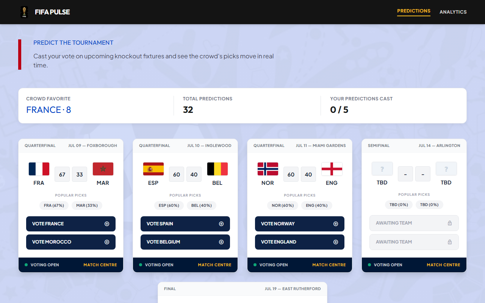
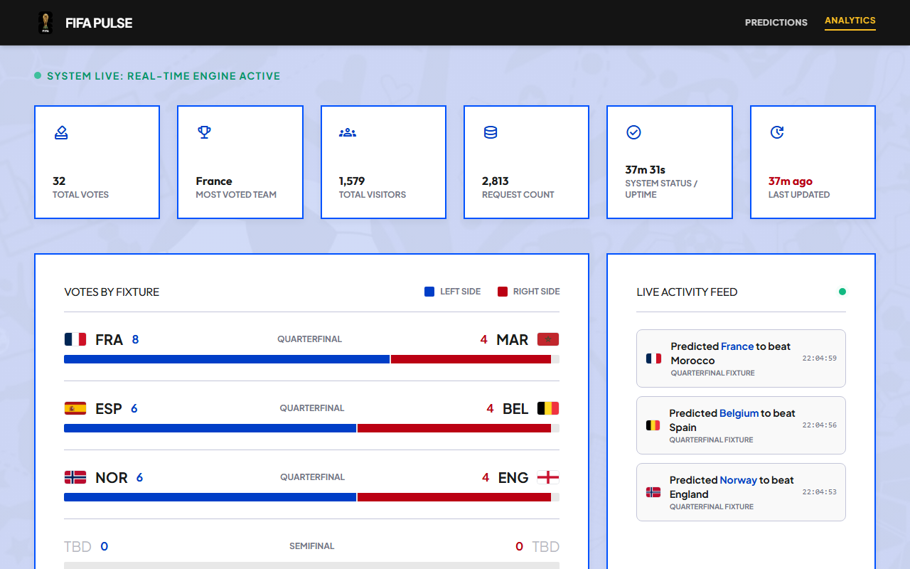
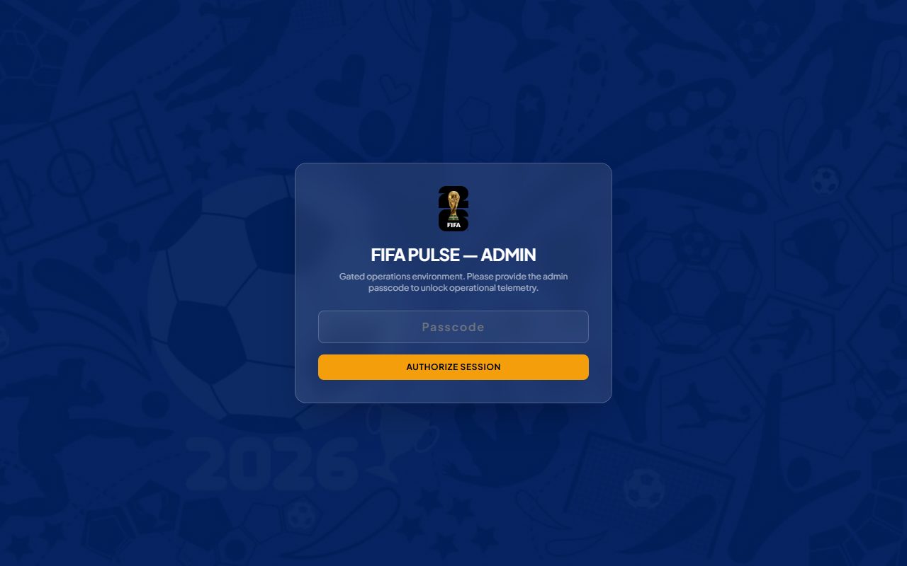
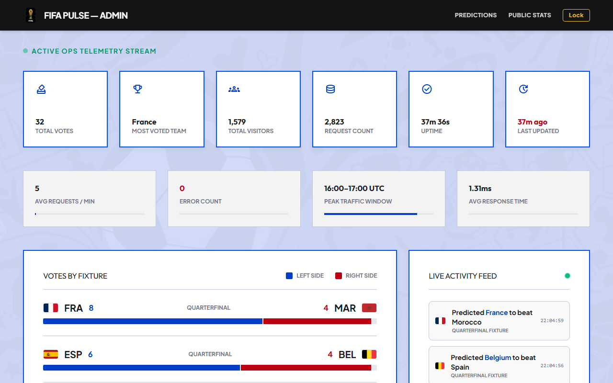

# FIFA Pulse: System Architecture & Deployment Report

This document serves as the official project report and architecture walkthrough for the **FIFA Pulse** match prediction and telemetry platform.

---

## 1. Architecture Overview

FIFA Pulse is built as a single, unified Node.js/Express service hosting both the client applications and the telemetry streaming engine. It keeps a lightweight, high-performance profile suitable for deployment on free-tier container instances.

### System Architecture Layout

```text
                                +----------------------------------------+
                                |              Web Browser               |
                                |  +------------------+---------------+  |
                                |  |  Predictions UI  |  Analytics UI |  |
                                +--+--------+---------+-------+-------+--+
                                            |                 ^
                             HTTP Requests  |                 | Live Telemetry
                             (POST / GET)   |                 | (SSE Stream)
                                            v                 |
+------------------------------------------+-----------------+----------+
|  Unified Express Server (Port 3000)                                   |
|                                                                       |
|  +--------------------+   +-------------------+   +----------------+  |
|  | Static File Server |   |  CORS Middleware  |   | Telemetry MW   |  |
|  | (Serves UI Assets) |   | (Access Control)  |   | (Request Logs) |  |
|  |                    |   |                   |   | (Latency Ticks)|  |
|  +--------------------+   +---------+---------+   +--------+-------+  |
|                                     |                      |          |
|                                     v                      |          |
|  +----------------------------------+------------------+   |          |
|  |                   API Route Handlers                |   |          |
|  |  - /api/matches (GET)      - /api/stats (GET)       |<--+          |
|  |  - /api/results (GET)      - /api/metrics (GET)     |              |
|  |  - /api/vote (POST)        - /api/stats/stream (SSE)|              |
|  +----------------------------------+------------------+              |
|                                     |                                 |
|                                     v (Serialized Write Queue)        |
|                              +------+-------+                         |
|                              |  db.json     |                         |
|                              | (JSON DB)    |                         |
|                              +--------------+                         |
+-----------------------------------------------------------------------+
```

### Key Components:

1. **Predictions Frontend (`/`)**: A client-side vanilla JavaScript app allowing anonymous fans to cast predictions for World Cup fixtures. It uses cookies for unique tracking and local storage to prevent duplicate votes on the same match.
2. **Public Analytics (`/analytics`)**: Real-time display showing total votes, most voted team, total unique visitors, server request volume, and live server uptime. It features a side-by-side **Live Activity Feed** rendering new predictions as they are logged.
3. **Command Center (`/analytics/admin`)**: A passcode-gated Operations dashboard containing system logs, latency history, error frequencies, and routing distributions for engineers.
4. **Server Sent Events (SSE) Stream (`/api/stats/stream`)**: A persistent HTTP stream that pushes real-time updates to all connected clients immediately when a prediction is made.

---

## 2. Cloud Services & Platforms Used

- **Host Runtime**: **Node.js 20 / Express**
- **Deployment Platform**: **Render** (Free Web Service tier).
- **Continuous Integration**: **GitHub Actions** (triggering code quality checks, syntax lints, and API smoke tests on every push/PR).

---

## 3. Deployment Steps Followed

The project is configured for automated cloud deployments using the Render Blueprint specification file (`render.yaml`):

1. **GitHub Setup**: Pushed the repository containing `backend/`, `frontend/`, `analytics/`, and config files to GitHub.
2. **Render Blueprint Import**:
   - Logged into the Render dashboard and created a new **Blueprint** service.
   - Linked the GitHub repository.
   - Render automatically parsed the `render.yaml` specification and configured the service.
3. **Manual Setup Fallback**:
   - **Environment**: Web Service
   - **Language**: Node
   - **Root Directory**: `backend`
   - **Build Command**: `npm ci`
   - **Start Command**: `node server.js`
   - **Environment Variable**: `NODE_VERSION = 20`
4. **CI/CD Lock**: Configured Auto-Deploy to trigger only after GitHub Actions tests succeed.

---

## 4. Key Engineering Challenges Faced & Solutions

### Challenge A: File Write Corruption under Concurrent Traffic

**Problem**: In an application utilizing a flat-file JSON datastore (`db.json`), concurrent file writes (e.g., when two users submit a vote at the exact same millisecond) cause overlapping disk write operations. This results in file corruption and server crashes upon reboot.
**Solution**: Implemented a serialized promise queue (`writeChain`) in [server.js](file:///d:/GDGC/FIFA%20Analytics/backend/server.js#L54-L61). Every write request is chained onto the resolution of the previous write:

```javascript
let writeChain = Promise.resolve();
function persist() {
  writeChain = writeChain
    .then(() => fsp.writeFile(DB_PATH, JSON.stringify(db, null, 2)))
    .catch((err) => console.error("[persist] write failed:", err.message));
  return writeChain;
}
```

This guarantees FIFO (First-In-First-Out) execution ordering, ensuring data integrity.

### Challenge B: Session Sync Across Tabs for Live Activity Feed

**Problem**: The live activity feed was initially calculated solely client-side by comparing sequential polling cycles. If a user voted on 3 matches quickly, or if they loaded the analytics page in a new tab, the dashboard had no history to display.
**Solution**: Upgraded the database schema to log the last 15 votes dynamically in a `votesLog` queue on the server. When the dashboard loads or receives an SSE update, it pulls the complete log array, ensuring full sync across tabs and instant loading of recent activity.

---

## 5. Bonus Tasks Implemented

- **[Optional] Real-Time Analytics**: Built and styled a live-ticking **Activity Feed** showing matching context (e.g., _Spain to beat Belgium_).
- **[Optional] Monitoring & Logging**: Implemented a **Live Latency History Chart** feeding on actual response durations measured by `process.hrtime.bigint()`, dynamically highlights high latency requests (`>= 150ms`) in red.
- **[Optional] Branded 404 Page**: Serving custom HTML files from `frontend/404.html` for unknown paths.

---

## 6. Live Deployment & Repository Links

- **Source Code Repository**: [aspartic-gthb/FIFA_Pulse on GitHub](https://github.com/aspartic-gthb/FIFA_Pulse)
- **Prediction Platform (Live)**: [https://fifa-pulse.onrender.com/](https://fifa-pulse.onrender.com/)
- **Analytics Dashboard (Live)**: [https://fifa-pulse.onrender.com/analytics](https://fifa-pulse.onrender.com/analytics)
- **Gated Command Center (Live)**: [https://fifa-pulse.onrender.com/analytics/admin](https://fifa-pulse.onrender.com/analytics/admin) (Passcode: `gdgc2026`)

---

## 7. Application Screenshots

### Prediction Platform & Voting Functionality

_Displays all 5 upcoming knockout fixtures, shows real-time percentage indicators of crowd predictions, and locks dynamically once a prediction is cast._



---

### Live Analytics Dashboard

_Streams real-time global telemetry updates (total votes, visitors, requests) and displays a head-to-head vote ratios chart and a live-ticking activity feed._



---

### Gated Operations Command Center (Locked)

_Displays a blurred passcode lock screen to prevent unauthorized operational access._



---

### Gated Operations Command Center (Unlocked)

_Provides deep infrastructure telemetry (requests/min, peak traffic hours, response times), route distributions, a live error log console, and a live request latency chart highlighting requests $\ge 150\text{ms}$ in red._


